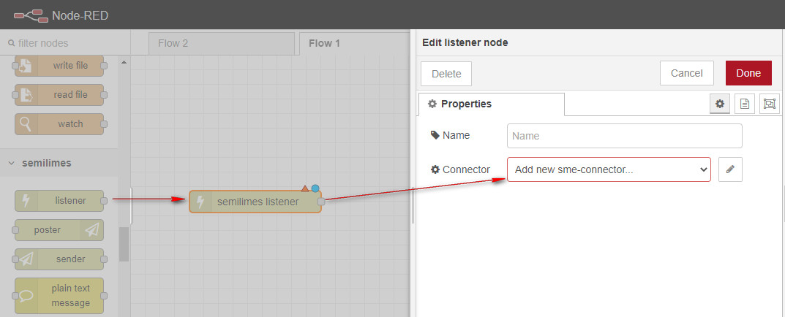
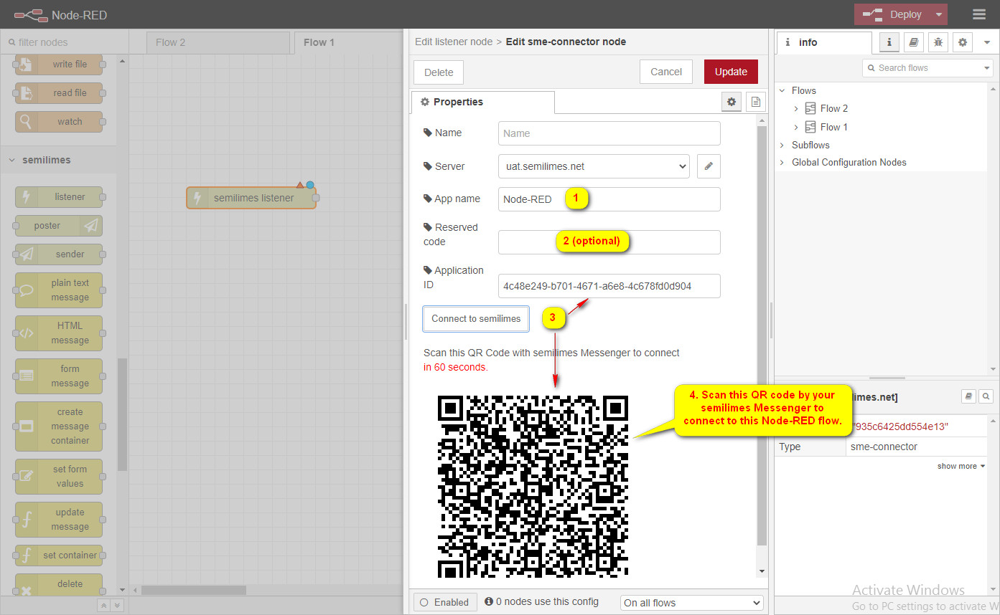

# Node-RED semilimes
     

This package of Node-RED nodes to extends your semilimes account with your programming ability, such as auto reply, booking flow or even message-base interface of your exsting system to expose to semilimes Messenger.

## Agenda
- Connect Node-RED to semlimes Messenger.
- Send and receive message with contacts in semlimes Messenger.
- Collect user input with semilimes Messenger's forms.
- Expose data to semilimes Messenger.

## Installation

You can install the nodes using node-red's "Manage palette" in the side bar.

Or run the following command in the root directory of your Node-RED installation

    npm install node-red-contrib-semilimes --save

## Installation of the mobile apps
- IOS semilimes Messenger :   

- Android semilimes Messenger :   

## Dependencies
The nodes are tested with `Node.js v12.0.0` and `Node-RED v1.3.7`.

## Connect to semilimes
Setup connection to semilimes server in Node-RED flow.

1. Add a `listener` node then config its `Connector` property to create a `connector` configuration.

2. Configure the `connector` node and connect it to semilimes.

3. Add a `sender` node and configure its `Connector` property to the same `connector` configuration.
You now can both send and receive messages with semilimes using the `listener` and `sender` nodes.

Sample flow to connect to semilimes, send and receive messages.
[Connect to semilimes flow](examples/connect%20to%20semilimes%20flow.json)

# Examples
- [Sample flow](examples/send HTML message flow.json) to send [HTML Message](docs/HtmlMessage.md) to semilimes.

# License
Apache License
Version 2.0, January 2004
http://www.apache.org/licenses/
