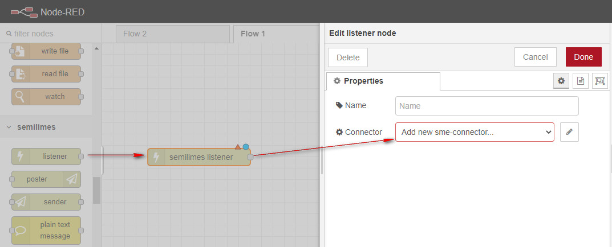
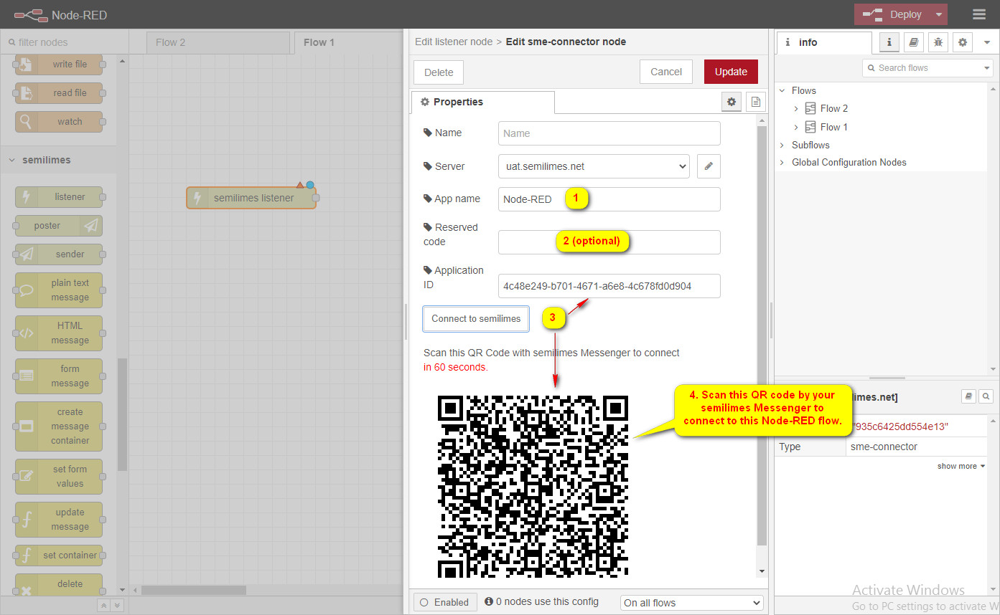

# Connect to semilimes
Setup connection to semilimes server in Node-RED flow.

1. Add a `listener` node then config its `Connector` property to create a `sme-connector` configuration.

2. Configure the `sme-connector` node and connect it to semilimes.

*Optionally use 'uat.semilimes.net' for development.*

3. Add a `post` node and configure its `Connector` property to the same `sme-connector` configuration.
You now can both send and receive messages with semilimes using the `listener` and `post` nodes.

Try this flow to connect to semilimes, send and receive messages.

# References
Sample  to send  to semilimes.